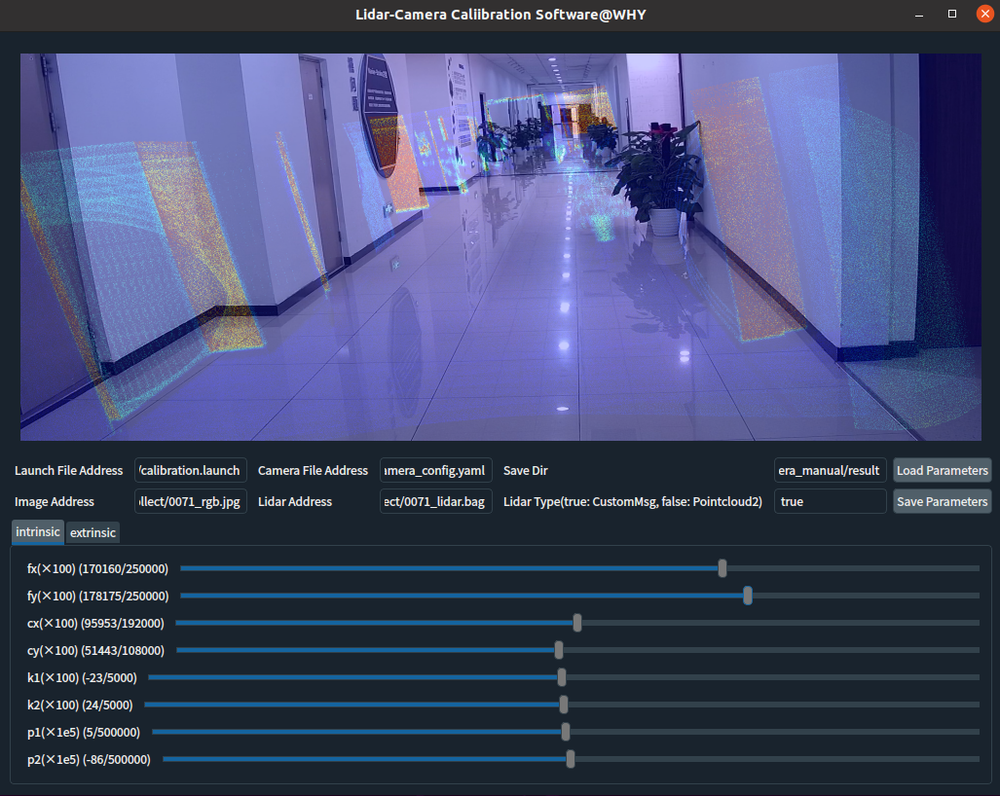
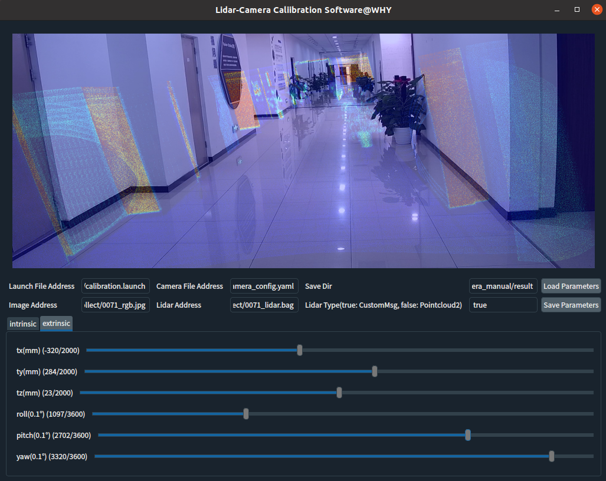
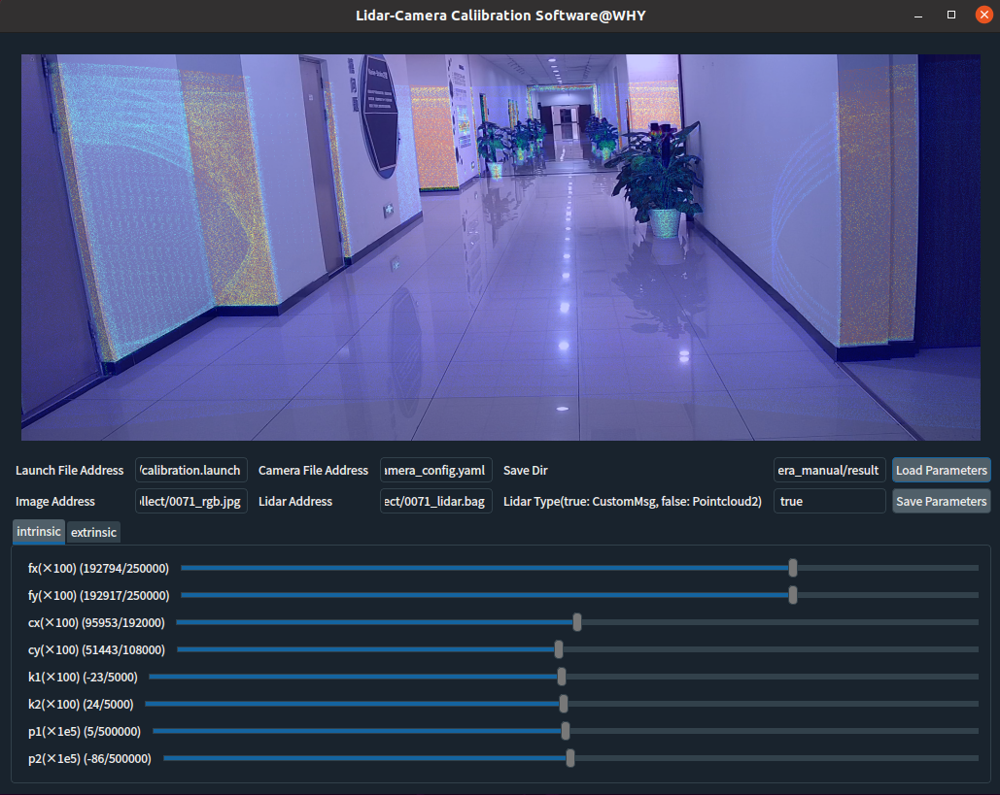
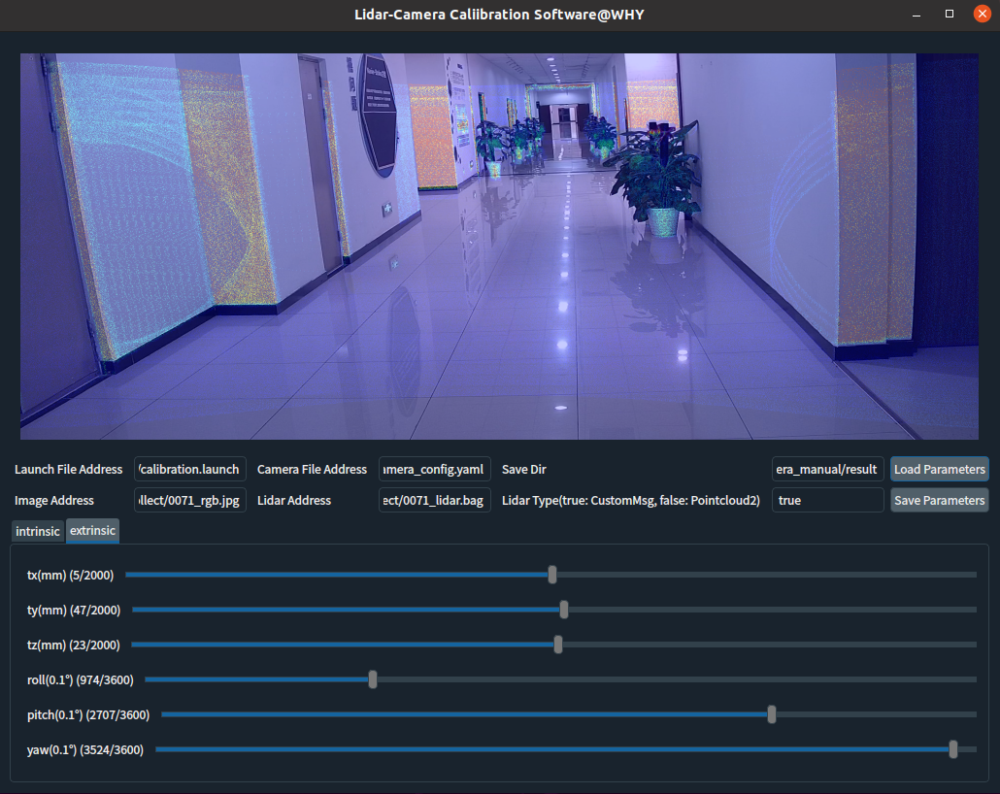

# 激光雷达-相机标定工具
## 一、介绍
### 1.1 动机
学术界提出了许多新颖、先进的激光雷达-相机target-free/target-based标定算法，但目前仍没有一种在任意场景数据上均能得到较好标定效果的算法，在工业界往往需要使用标定工具进行内外参数微调。

### 1.2 开发细节
本仓库在ROS环境下开发了一个针对高空间分辨率固态激光雷达与可见光相机的手动标定软件工具，可以对相机内参fx,fy,cx,cy,k1,k2,p1,p2以及外参tx,ty,tz,roll,pitch,yaw进行调整,软件界面见第三节。

技术细节方面，使用C++开发主要功能(点云滤波、投影、伪彩色增强、融合等操作)并编译封装成.so动态连接库；使用python开发软件界面，通过ctypes库调用动态链接库中的函数与用户进行交互；最后将标定参数保存在本地yaml文件。

## 二、环境与依赖
1. 环境：Ubuntu ROS
2. 依赖：ROS(主要用来读取.bag文件，若文件格式为.pcd等其它点云格式，可以去除ROS), PCL, OpenCV, Eigen, pyqt5
3. 编译运行过程
```
# 编译C++动态链接库
mkdir build & cd build
cmake ..
make
# 运行python代码
cd ../app
python main.py
```

## 三、标定效果

<p align="center"></p>
<h6 align="center">初始相机内外参数</h6>

<p align="center"></p>
<h6 align="center">手动调整相机内外参数结果</h6>
